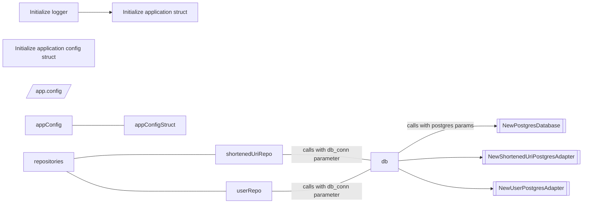
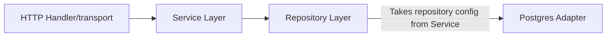
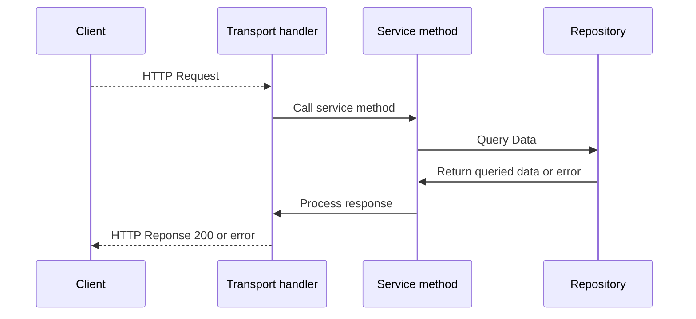
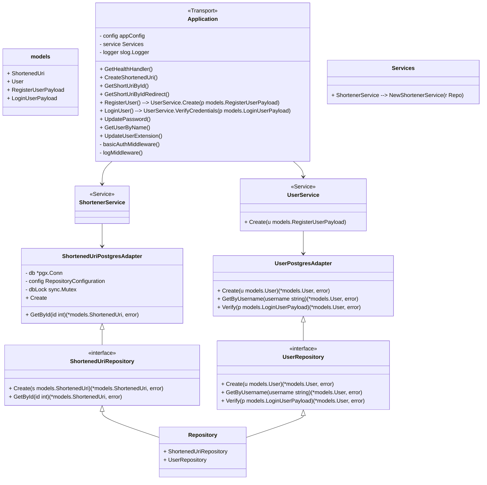

# url-shortener 🤏🏻


A simple server application that offers HTTP redirection via an REST API.

## whats next? 📅

i need to check if a user with username already exists. Otherwise the DB returns an error `ERROR: duplicate key value violates unique constraint "users_username_key" (SQLSTATE 23505)` but the index (id) increases anyways. I suppose i could check if the username exists inside 'service/user.go'? done

i need to create a login endpoint that is able to check user data and then maybe use a middleware or something to inject a token, cookie or something?

## to check 🔍

/health has about 19ms of delay when using basic auth with argon2id. Have to check if JWT is more performant so i dont have to Verify login credential each time.

investigate concurrent requests with db hits. Currently db connections are locked via mutex (per repository, which is shit)

```shell
~/go/bin/gohttpbench -c 150 -n 100000 -T "application/json" -p req.json http://localhost:8090/v1/

This is GoHttpBench, Version 0.1.9, https://github.com/parkghost/gohttpbench
Author: Brandon Chen, Email: parkghost@gmail.com
Licensed under the MIT license

Benchmarking localhost (be patient)
Completed 10000 requests
Completed 20000 requests
Completed 30000 requests
Completed 40000 requests
Completed 50000 requests
Completed 60000 requests
Completed 70000 requests
Completed 80000 requests
Completed 90000 requests
Completed 100000 requests
Finished 100000 requests


Server Software:        
Server Hostname:        localhost
Server Port:            8090

Document Path:          /v1/
Document Length:        38 bytes

Concurrency Level:      150
Time taken for tests:   78.23 seconds
Complete requests:      100000
Failed requests:        0
HTML transferred:       3893851 bytes
Requests per second:    1278.22 [#/sec] (mean)
Time per request:       117.351 [ms] (mean)
Time per request:       0.782 [ms] (mean, across all concurrent requests)
HTML Transfer rate:     48.60 [Kbytes/sec] received

Connection Times (ms)
              min       mean[+/-sd]     median  max
Total:        1         0   8.37        115     226

Percentage of the requests served within a certain time (ms)
 50%     115
 66%     116
 75%     118
 80%     119
 90%     122
 95%     129
 98%     145
 99%     158
 100%    226 (longest request)
```



## Request flow





## http handlers


