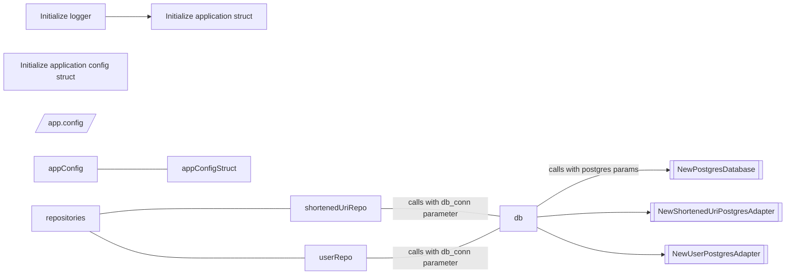

# url-shortener

A simple server application that offers HTTP redirection via an REST API.

## whats next?

i need to check if a user with username already exists. Otherwise the DB returns an error `ERROR: duplicate key value violates unique constraint "users_username_key" (SQLSTATE 23505)` but the index (id) increases anyways. I suppose i could check if the username exists inside 'service/user.go'? done

i need to create a login endpoint that is able to check user data and then maybe use a middleware or something to inject a token, cookie or something?

## to check

/health has about 19ms of delay when using basic auth with argon2id. Have to check if JWT is more performant so i dont have to Verify login credential each time.

