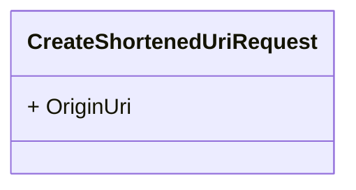

# url-shortener models

Below is an overview of each model:

## shortened_uri

| Name       | Description                                              |
| :--------- | :------------------------------------------------------- |
| id         | Identifier for a shortened uri.                          |
| origin_uri | Saves the original URI that users will be redirected to. |

